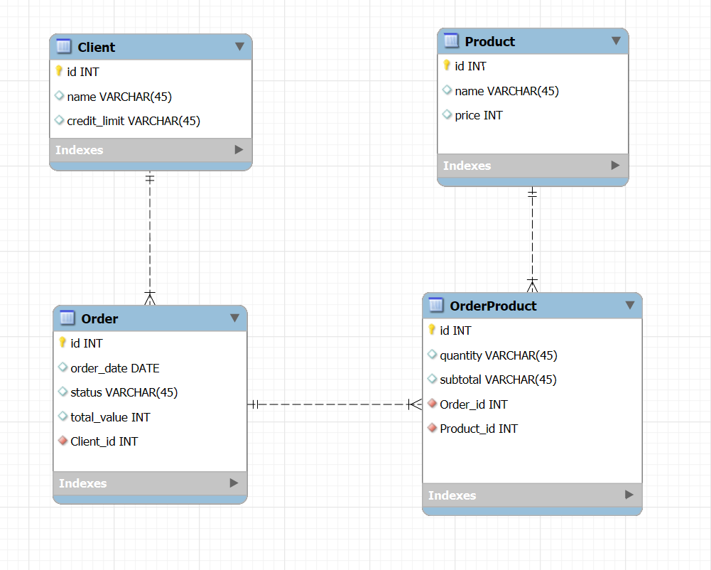

# Backend Spring Boot + Docker Compose

Este projeto contém a API backend desenvolvida em Spring Boot, que pode ser executada localmente com Docker Compose para facilitar a configuração do banco de dados e do ambiente.

---

## Pré-requisitos

- Java JDK 17 (para executar localmente sem Docker)
- [Docker](https://docs.docker.com/get-docker/) instalado e rodando
- [Docker Compose](https://docs.docker.com/compose/install/) instalado

---

# Modelo ER


## Passos para executar

```bash
git clone https://github.com/ThArthur/order-back.git
cd order-back
docker-compose up -d
mvn clean spring-boot:run
